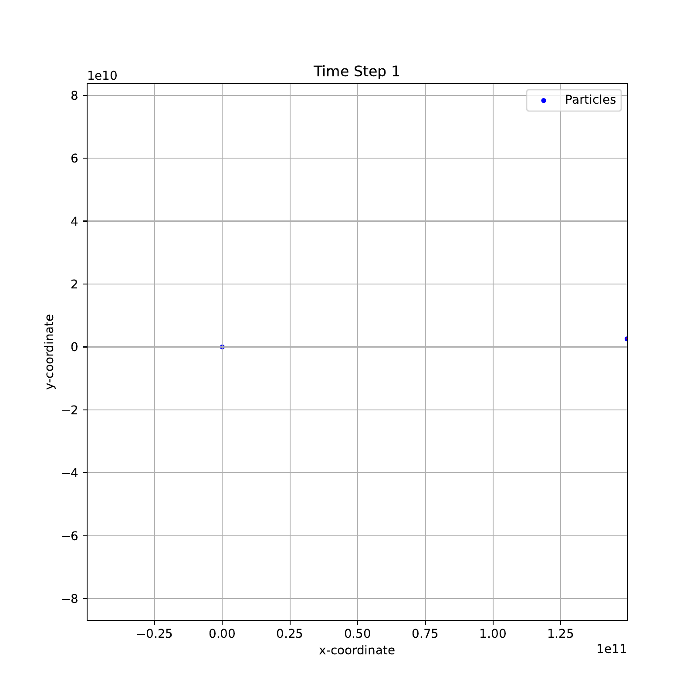

# create an executable file named program

make 

# how to run the executable file 

./program < num_particles > < time > < iterations > < log_interval >

the program will generate output file named solar.tsv

# how to plot multiple PDFs

pip install matplotlib

make plot

PDFs file name: solar.pdf

# how to make an animation GIF 

pip install pdf2image

make animation

GIF name: solar_animation.gif

# how to clean all program, .tsv, .pdf and .gif files 

make clean

# three testing examples

sun earth system 

./program 2 86400 365 10

sun earth moon system 

./program 3 100 31536000 86400

random larger particles system

./program 100 5000 1000 100

# how to benchmark 

cd N_Body

make

sbatch script.sh 

output is saved into result.txt
